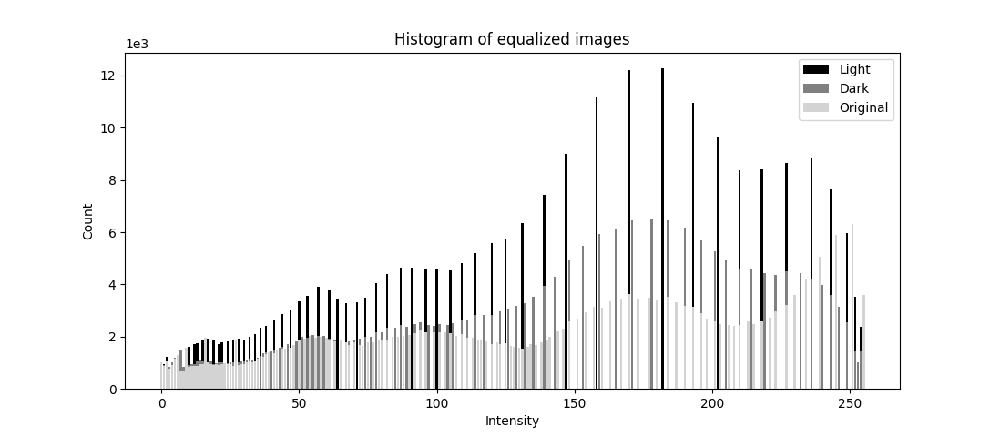
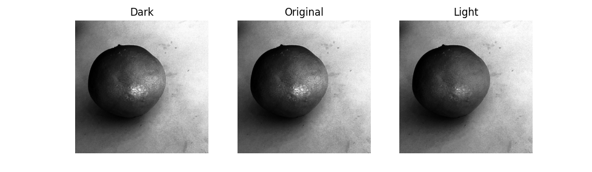

## Histogram Equalization Naively Explained

Sometimes, one image can be too dark, too bright or have really low contract, which can be all seen in the histogram of the image. We can see from below that these histograms are not evenly distributed or not spread out enough.

So we can develop a method to spread out the histogram of the image, i.e. make every intensity value (histogram bin) have similar (better the same) number of pixels. This is called histogram equalization.

### Histogram

The following code snippet shows how to plot a histogram of an image, and to plot a histogram of an image with a certain bin size.

```python
import cv2 as cv
import numpy as np

def cal_hist(image: np.ndarray) -> np.ndarray:
    # we need gray image as input
    hist = np.zeros(256, np.int32)
    for i in range(image.shape[0]):
        for j in range(image.shape[1]):
            hist[image[i, j]] += 1
    return hist
```

These three images are preprocessed by phone app by changing the exposure and lowing the contrast. We can see that the histogram is not evenly distributed. But we can imagine that the "information" is not very different, just that the histogram is not spread out enough.


### Accumulative Histogram
First, let's define the accumulative histogram. It is the sum of all the previous histogram bins, like the integral of the distribution function. Intuitively, it is the number of pixels that have intensity value less than or equal to the current intensity value.

```python
def cal_accum_hist(hist: np.ndarray) -> np.ndarray:
    accum_hist = np.zeros(256, np.int32)
    accum_hist[0] = hist[0]
    for i in range(hist.shape[0]):
        accum_hist[i] = accum_hist[i-1] + hist[i]
    return accum_hist
```


### Target Histogram and Accumulative Target
Target histogram is the evenly distributed histogram. Also, the accumulative target histogram looks like a straight line, y = x.


### Histogram Equalization
Now, we can calculate the mapping function from the original to the target histogram. The algorithm is quite simple. We count the accumulative histogram of the original image, and right after the number is larger than the target index, we stop and record the index. This index is the mapping from the original to the target.

```python
def histo_eq(image: np.ndarray) -> np.ndarray:
    hist = cal_hist(image)
    accum_hist = cal_accum_hist(hist)
    T = np.zeros(256, np.uint8)  # transformation function, i.e. mapping from old intensity to new intensity
    for i in range(256):  # for each intensity value
        # shape[0] * shape[1] = total number of pixels
        # 255 is the maximum intensity value
        # for each intensity, the new intensity is the number of pixels with intensity
        # less than or equal to i
        T[i] = 255 * accum_hist[i] / (image.shape[0] * image.shape[1])
    image_eq = np.zeros(image.shape, np.uint8)
    for i in range(image.shape[0]):
        for j in range(image.shape[1]):
            image_eq[i, j] = T[image[i, j]]
    return image_eq
```

## Results
This is the histogram qualized. We can see the larger value intesity have more white space around, and the smaller value intensity have are more clustered together. As the mapping is still value to value, so it seems that the shape is still the same. But we can see more intuitively from the histogram with bin size of 16. The histogram is more evenly distributed.




In the final image, we can see that all the images achieve similar brightness and contrast. The first image is too dark, the second image is too bright, and the third image is too low contrast. But after histogram equalization, they all look similar.