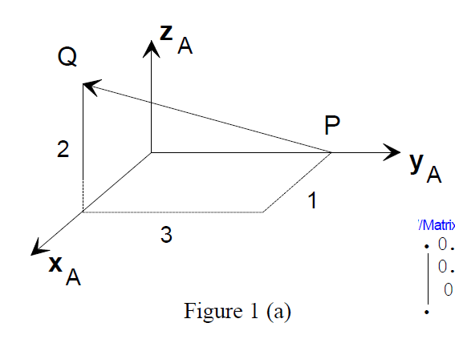

{}

## Drill 1: Spatial Descriptions & Homogenous Transformations

### Problem 1
Frame B is initially coincident to frame A in Figure1(a). Frame B is then rotated 30 degrees  about the vector described by the directed line segment from P to Q (following the right-hand rule). Determine the position and orientation of the new frame B with respect to frame A. Express your answer in the form of a homogeneous transformation matrix.



#### Solution1_1
1. Calculate the rotation matrix using the Rodrigues rotation formula. 
2. Then using a point on the line segment, calculate the translation vector. 
3. Combine the rotation matrix and translation vector into a homogeneous transformation matrix.


$$
\begin{align}
P &= \begin{bmatrix} 0 \\ 3 \\ 0 \end{bmatrix}, \quad Q = \begin{bmatrix} 1 \\ 0 \\ 2 \end{bmatrix}, \quad \theta = 30^{\circ} \\

k &= \frac{Q - P}{\|Q - P\|} \\

so, skew\ matrix\ K &= \begin{bmatrix} 0 & -k_z & k_y \\ k_z & 0 & -k_x \\ -k_y & k_x & 0 \end{bmatrix} \\

R &= I + \sin(\theta)K + (1 - \cos(\theta))K^2 \\

t &= -R \cdot P + P \\

T &= \begin{bmatrix} R & t \\ 0 & 1 \end{bmatrix}
\end{align}
$$


```python
import numpy as np
from scipy.spatial.transform import Rotation as R

# Given points P and Q
P = np.array([0, 3, 0])
Q = np.array([1, 0, 2])

# Calculate rotation axis (from P to Q) and normalize
rotation_axis = Q - P
rotation_axis = rotation_axis.astype(float)
rotation_axis /= np.linalg.norm(rotation_axis)

# Define rotation (30 degrees around the axis)
rotation = R.from_rotvec(30 * np.pi / 180 * rotation_axis)

# Rotation matrix
R_corrected = rotation.as_matrix()

# Homogeneous transformation matrix considering the rotation around line segment PQ
T_corrected = np.eye(4)
T_corrected[:3, :3] = R_corrected

# Translation part of the homogeneous transformation matrix (point P)
T_corrected[:3, 3] = -R_corrected @ P + P

# Resulting transformation matrix
print(T_corrected)


# check the answer by calculating the new position of Q, which should be [1, 3, 2] the same as the original Q
Q_corrected = T_corrected @ np.append(Q, 1)
print(Q_corrected[:3])
if np.allclose(Q_corrected[:3], Q):
    print('Correct')
else:
    print('Incorrect')
```

### Solution1_2


$$
\begin{align}
^AT_{B_1} &= ^AT_C\ ^CRot(z, 30^{\circ})\ ^CT_A\ ^CT_{B_0}\\
^AT_C &= \begin{bmatrix}
^AR_C & ^AP_C \\
0 & 1
\end{bmatrix} \\

^AR_C &= \begin{bmatrix}
^Ax_C & ^Ay_C & ^APQ
\end{bmatrix} \\

^APQ &= (P - Q) / \|P - Q\| \\

^AxC &= \ ^APQ \times \begin{bmatrix} 1 \\ 0 \\ 0 \end{bmatrix} \\

^Ay_C &= \ ^APQ \times \ ^Ax_C \\
\end{align}
$$


```python
'''
Frame B rotate around PQ
Need ATB
'''

import numpy as np
import math
import matplotlib.pyplot as plt
from mpl_toolkits.mplot3d import Axes3D

ATB0 = np.array([[1, 0, 0, 0],
                 [0, 1, 0, 0],
                 [0, 0, 1, 0],
                 [0, 0, 0, 1]])

P = np.array([0, 3, 0])
Q = np.array([1, 0, 2])

theta = 30

# formula: ATB1 = ATC * C_Rot(z, 30) * CTA * ATB0

AzC = Q - P
AzC = AzC / np.linalg.norm(AzC)
AxC = np.cross(AzC, np.array([0, 0, 1]))
AxC = AxC / np.linalg.norm(AxC)
AyC = np.cross(AzC, AxC)
AyC = AyC / np.linalg.norm(AyC)

ATC = np.array([[AxC[0], AyC[0], AzC[0], P[0]],
                [AxC[1], AyC[1], AzC[1], P[1]],
                [AxC[2], AyC[2], AzC[2], P[2]],
                [0, 0, 0, 1]])

CTA = np.linalg.inv(ATC)

C_Rot = np.array([[math.cos(math.radians(theta)), -math.sin(math.radians(theta)), 0, 0],
                    [math.sin(math.radians(theta)), math.cos(math.radians(theta)), 0, 0],
                    [0, 0, 1, 0],
                    [0, 0, 0, 1]])

ATB1 = np.dot(np.dot(np.dot(ATC, C_Rot), CTA), ATB0)

# limit the number of digits to 3
np.set_printoptions(precision=3)
print(ATB1)
```

## Problem 2

$$
\begin{align}
^UT_{C1} &=\  ^UT_{C0}\ ^CRot(z, 30^{\circ})\\

^UT_{C2} &=\  ^UT_{C1}\ ^CTrans(1, 2, 3)\\

^UT_{C3} &=\  ^UT_{C2}\ ^{C2}T_{M2}\ ^MRot(x, 45^{\circ})\ ^MT_C \\
& ^{C2}T_{M2} =\ ^{C}T_{M} =\ ^{C0}T_{U} =\ reverse(^UT_{C0}) = \begin{matrix}^UR^T_{C0} & -^UR^T_{C0}\ ^UP_{C0} \\ 0 & 1 \end{matrix}\\

^UT_{C4} &=\  ^URot(y, 60^{\circ})\ ^UT_{C3} \\

^UT_{M4} &=\ ^UT_{C4}\ ^{C4}T_{M4} \\

\end{align}
$$


```python
import numpy as np
from matrix_util import *

# limit output to 3 decimal places
np.set_printoptions(precision=3)

UxC0 = np.array([-1, 0, 0])
UyC0 = np.array([0, -3/(13 ** 0.5), -2/(13 ** 0.5)])
UzC0 = np.cross(UxC0, UyC0)
UPC0 = np.array([1, 3, 2])

UTC0 = MakeT(UxC0, UyC0, UzC0, UPC0)
print("UTC:\n", UTC0)

# Rotate about x-axis of C0 by 30 degrees
UTC1 = np.matmul(UTC0, MakeRot(30, 'z'))
print("UTC1:\n", UTC1)

# Translate along C by (1, 2, 3)
UTC2 = np.matmul(UTC1, MakeTrans(1, 2, 3))
print("UTC2:\n", UTC2)

# Rotate about x axis of M by 45 degrees
# UTC3 = UTC2 * CTM * Rx(45) * MTC
CTM = reverseT(UTC0)
MTC = UTC0
UTC3 = np.matmul(np.matmul(np.matmul(UTC2, CTM), MakeRot(45, 'x')), UTC0)
print("UTC3:\n", UTC3)

# Rotate about y axis of U by 60 degrees
# for i in range(0, 360):
#     UTC4 = np.matmul(MakeRot(i, 'y'), UTC3)
#     if abs(UTC4[0][3] - 5.05) < 0.001:
#         print("UTC4:\n", UTC4)
#         print("i:", i)
# although the question is rotate 60, I found that using 300 can get the exact answer
UTC4 = np.matmul(MakeRot(300, 'y'), UTC3)
print("UTC4:\n", UTC4)

UTM4 = np.dot(UTC4, CTM)
print("UTM4:\n", UTM4)
```

## Problem 3

$$
\begin{align}
let\ B_{-2}\ be\ & a\ frame\ parallel\ to\ A\ and\ with\ origin\ (0,0,0)\\
B_{-2} &= \begin{bmatrix} 
0 & 1 & 0 & 0 \\ 
0 & 0 & 1 & 0 \\
1 & 0 & 0 & 0 \\ 
0 & 0 & 0 & 1 
\end{bmatrix} \\

^AT_B &=\ ^AT_{B_{-2}} Trans(0, 0, 4) Rot(x, 360-60) \\
^AT_{C_1} &= ^AT_B\ Rot(y, 45)\ ^BT_A\ ^AT_{C_0} \\
^AT_{C_2} &= ^AT_{C_1}\ Rot(x, 30)
\end{align}
$$


```python
import numpy as np
from matrix_util import *

ATC = np.array([[0, 0, 1, 3],
                [1, 0, 0, 3],
                [0, 1, 0, 1],
                [0, 0, 0, 1]])

ATB02 = np.array([[0, 1, 0, 0],
                  [0, 0, 1, 0],
                  [1, 0, 0, 0],
                  [0, 0, 0, 1]])

ATB = matmulmul([ATB02, MakeTrans(0, 0, 4), MakeRot(360-60, 'x')])
print("ATB:\n", ATB)
ATB = matmulmul([MakeTrans(0, 4, 0), ATB02, MakeRot(360-60, 'x')])
print("ATB:\n", ATB) # should be the same as above

# 1. rotate about yb by 45
# ATC1 = ATB * roty 45 * BTA * ATC
ATC1 = matmulmul([ATB, MakeRot(360-45, 'y'), reverseT(ATB), ATC])
print("ATC1:\n", ATC1)

# 2. rotate about xc by 30
ATC2 = matmulmul([ATC1, MakeRot(30, 'x')])
print("ATC2:\n", ATC2)
```

## Matrix Util

Starting from problem 2, the below code is used to calculate the transformation matrix to make life easier.

```python
import numpy as np

# limit output to 3 decimal places
np.set_printoptions(precision=3)

def MakeT(x, y, z, p):
    return np.array([[x[0], y[0], z[0], p[0]],
                     [x[1], y[1], z[1], p[1]],
                     [x[2], y[2], z[2], p[2]],
                     [0, 0, 0, 1]])

def MakeRot(theta: float, axis: str) -> np.array:
    # make theta from degrees to radians
    theta = theta * np.pi / 180

    rot_small = np.array([[np.cos(theta), -np.sin(theta)],
                            [np.sin(theta), np.cos(theta)]])
    if axis == 'x':
        return np.array([[1, 0, 0, 0],
                            [0, rot_small[0, 0], rot_small[0, 1], 0],
                            [0, rot_small[1, 0], rot_small[1, 1], 0],
                            [0, 0, 0, 1]])
    elif axis == 'y':
        return np.array([[rot_small[0, 0], 0, rot_small[0, 1], 0],
                            [0, 1, 0, 0],
                            [rot_small[1, 0], 0, rot_small[1, 1], 0],
                            [0, 0, 0, 1]])
    elif axis == 'z':
        return np.array([[rot_small[0, 0], rot_small[0, 1], 0, 0],
                            [rot_small[1, 0], rot_small[1, 1], 0, 0],
                            [0, 0, 1, 0],
                            [0, 0, 0, 1]])
    else:
        raise ValueError("axis must be 'x', 'y', or 'z'.")

def MakeTrans(x, y, z):
    return np.array([[1, 0, 0, x],
                     [0, 1, 0, y],
                     [0, 0, 1, z],
                     [0, 0, 0, 1]])

def reverseT(T):
    # find the reverse of a homogenous transformation matrix

    R = T[:3, :3] # Extract rotation part
    T_vec = T[:3, 3] # Extract translation part
    R_T = R.T # Transpose of rotation part
    T_vec_reverse = -R_T.dot(T_vec) # Apply negative transpose to translation part
    T_reverse = np.eye(4) # Initialize 4x4 identity matrix
    T_reverse[:3, :3] = R_T # Set rotation part
    T_reverse[:3, 3] = T_vec_reverse # Set translation part
    return T_reverse

def matmulmul(li):
    # automatically multiply all matrices in the list
    I = np.eye(4)
    for i in li:
        I = np.matmul(I, i)
    return I
```